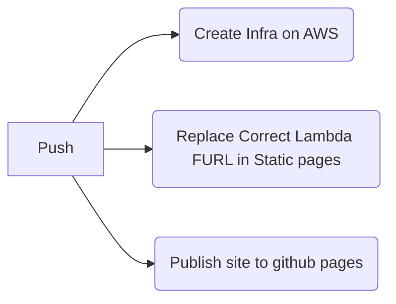

## Mindstix Bootcamp 2025

- [x] Setup Github Workflow (with the help of github market place).
- [ ] Github Pages.

Changing Approach
1. Github Pages: Host Webapp
2. AWS Infrasture: Hosts RESTapi and rest of the resources.

Todo
1. Get Site Working
    - Front End Working with proper reporting of error and have correct remote(dns) for backend instance.

## Resources and References

- [Terraform Remote Backend](https://stackoverflow.com/questions/47913041/initial-setup-of-terraform-backend-using-terraform)
