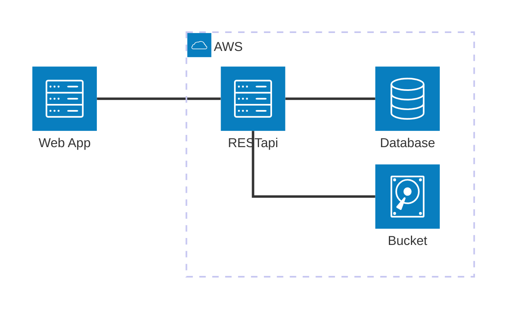
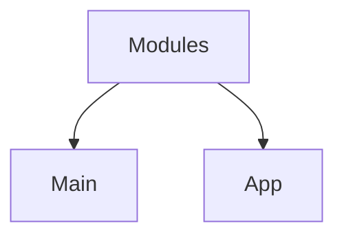
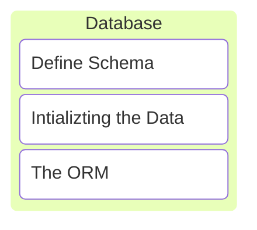
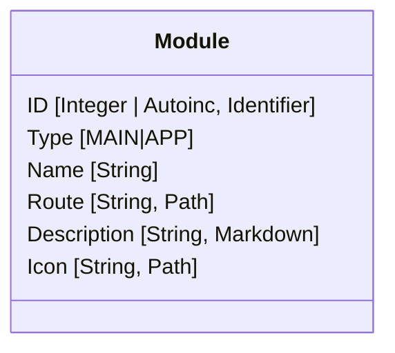
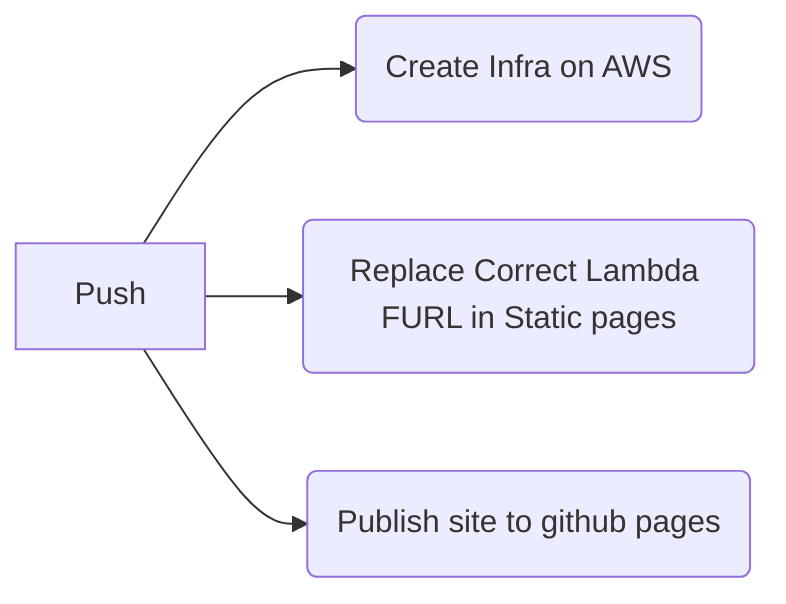

## Mindstix Bootcamp 2025

[](https://github.com/rhlm-msx/bootcamp/actions/workflows/infra.yaml)

- [Explore the App](https://rhlm-msx.github.io/bootcamp/)


## The Architecture



### Modules

- Frontend
    - Part of Web App.
- Backend
    - APIs for that modules
- Each module is responsible for initializting its resources and validating them

- The Main Module requires.
    + Database
    + Bucket


> There are two types of modules



> Main: The Webapp, and main routes in backend of restapi.


### Main Module

- Fetch Available Modules.
- Data
    1. Type: MAIN/APP
    2. Icon
    3. Description


### Modules

1. Frontend.
2. Backend (RESTapi).

## The Main Module Implementation



## The Main Module Database

- It need to be aware of other modules.
- Information about its own




---

- [x] Setup Github Workflow (with the help of github market place).
- [x] Github Pages.
- [ ] S3 Bucket AWS
- [ ] Empty ECR on Destroy


Changing Approach

1. Github Pages: Host Webapp.
2. AWS Infrasture: Hosts RESTapi and rest of the resources


## Github Workflow




Todo
1. Get Site Working
    - Front End Working with proper reporting of error and have correct remote(dns) for backend instance.

## Local Deployement

- Localstack.
    - AWS Lambda with layers
    - S3 Bucket
    - Database

- Intialization of Resources
    - AWS Lambda (Image and Code).
    - S3 Bucket  (Upload and Syncronise Assets).
    - Database
        - SQL ().
        - NoSQL ().


## Complete Deployment

- Intialization of Resources
    - AWS Lambda (Image and Code).
    - S3 Bucket  (Upload and Syncronise Assets).
    - Database
        - SQL ().
        - NoSQL ().


## Requirements

### Deploy app in local

```bash
$ make local
```


### Deploy app in cloud
```bash
$ make cloud
```


## Information

Since when using localstack the deployement cant be with Docker Image therefore Layers must be used for larger pacakages.

### The Layer Code

> Extracted in /opt
therefore must be in pythonpaths.

> Expected zip structure => /python/content


### The Function Code

> Extracted in /var/task


## Resources and References

- [Terraform Remote Backend](https://stackoverflow.com/questions/47913041/initial-setup-of-terraform-backend-using-terraform)
