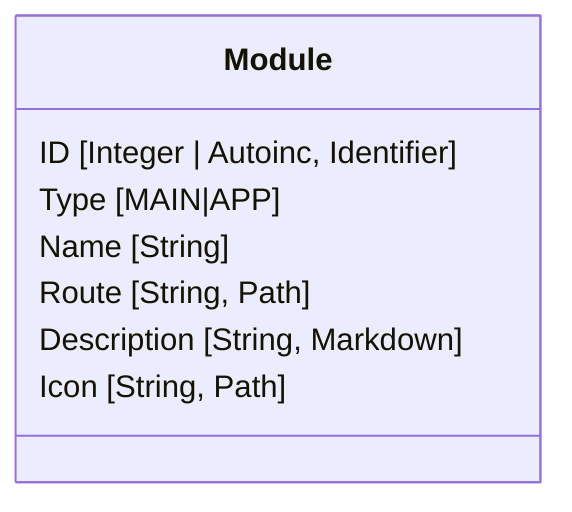

# The Database

## Introduction

using postgresql as database.

## Schema

1. main <Tables of Modules>

## Schema: main

1. modules

```mermaid

classDiagram
    class Module
    Module: ID [Integer | Autoinc, Identifier]
    Module: Type [MAIN|APP]
    Module: Name [String]
    Module: Route [String, Path]
    Module: Description [String, Markdown]
    Module: Icon [String, Path]
```

